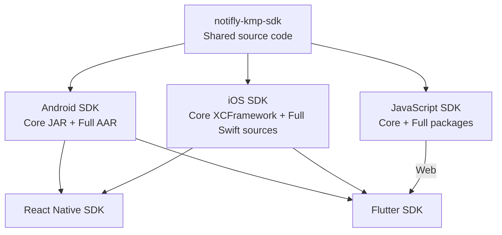

<p align="center">
  <a href="https://notifly.tech">
    
  </a>
</p>

<h1 align="center">Notifly KMP SDK</h1>

<p align="center">
  Shared Kotlin Multiplatform core for the Notifly Android, iOS, and JavaScript SDKs.
</p>

<p align="center">
  <a href="https://github.com/notifly-tech/notifly-kmp-sdk/actions/workflows/ci.yml"></a>
  <a href="https://github.com/notifly-tech/notifly-kmp-sdk/blob/main/LICENSE"></a>
</p>

> [!NOTE]
> This repository contains shared source code. Each platform SDK builds and distributes its own Core and Full packages. Application developers can install either the Full SDK or the platform's Core package.

## Architecture



Each platform SDK keeps its existing public API and UI behavior. Shared logic and popup rendering requests live in this repository, with platform-specific HTTP engines behind the common implementation.

## Popup rendering

`PopupFactory.create(config)` creates a reusable renderer. Only the exact mode `ssr`
calls the injected rendering service; other modes return `static` without reading
event parameters. The host SDK remains responsible for displaying the result.

Kotlin callers pass `eventParams: Map<String, Any?>?` to `PopupRenderInput`. Swift
callers pass `[String: Any]` directly, including nested dictionaries, arrays,
booleans, numbers, and `NSNull()`. Callers no longer serialize event parameters to
an `eventParamsJson` string.

JavaScript callers use the JS-specific helper so native objects and arrays are
converted inside KMP:

```javascript
const popup = sdk.tech.notifly.kmp.popup;
const renderer = popup.PopupFactory.create(new popup.model.PopupRendererConfig(
  projectId, renderingBaseUrl, sdkVersion,
));
const input = popup.createPopupRenderInput(
  "ssr", campaignId, notiflyUserId, deviceId, "purchase",
  { items: [{ id: "P1", quantity: 2 }], enabled: true },
);
const task = renderer.render(input, (result) => {
  // Handle static, rendered, skipped, failed, or cancelled outcomes in the host SDK.
});
```

Null or omitted JS parameters become `{}`. Supported values are strings, booleans,
finite numbers, nulls, lists/JS arrays, and nested string-keyed maps/JS plain objects.
Unsupported values and circular references produce `invalid_request` without an
HTTP request. Nested JS `undefined`, functions, symbols, bigint, and class instances
are unsupported. JS numbers keep JavaScript's existing precision; Swift/Kotlin
64-bit integers are not rounded through `Double` during encoding. Do not mutate
Kotlin/Swift input collections while a render is pending.

Renderers reuse one lazily initialized HTTP client for the runtime lifetime and
require no explicit cleanup. Use `task.cancel()` to cancel an individual render;
this does not close the shared client or affect other requests. Keep each task
handle if the host needs to cancel work when a popup is dismissed or the SDK is
reset. Results are delivered asynchronously, with no main-thread guarantee.

## Platform integration

The Android, iOS, and JavaScript repositories pin a KMP source commit as a Git submodule and build their own Core artifacts. Core and Full use the same platform SDK version, and Full depends on that exact Core version.

| SDK | Integration and distribution |
| --- | --- |
| [Android](https://github.com/team-michael/notifly-android-sdk) | Gradle composite build; Core JAR and Full AAR distributed through JitPack. |
| [iOS](https://github.com/team-michael/notifly-ios-sdk) | Dynamic `NotiflyCore.xcframework` and Full SDK Swift sources, available through SwiftPM and CocoaPods. |
| [JavaScript](https://github.com/team-michael/notifly-js-sdk) | `notifly-core-sdk` and `notifly-js-sdk` on npm; browser bundles include the required Core code. |
| [React Native](https://github.com/team-michael/notifly-react-native-sdk) | Uses the Android and iOS SDKs through native bridges. |
| [Flutter](https://github.com/team-michael/notifly_flutter) | Uses the Android and iOS SDKs; Flutter Web uses the JavaScript SDK. |

The iOS repository hosts the Core binary on its own GitHub Releases. Customers do not need to select a separate KMP source version.

## Development

Requirements:

- JDK 17
- Node.js 22
- macOS with Xcode for Apple targets

Check Kotlin source, tests, and Gradle scripts before committing:

```bash
./gradlew ktlintCheck --no-daemon
```

Apply automatic formatting when needed, then rerun the check:

```bash
./gradlew ktlintFormat --no-daemon
./gradlew ktlintCheck --no-daemon
```

The ktlint Gradle plugin and engine versions are pinned in `build.gradle.kts`.
Style settings live in `.editorconfig`. CI and new releases run the check without
modifying files. Resuming an existing release skips lint so older tags remain
rebuildable. See [AGENTS.md](AGENTS.md) for English-language, comment, and test
conventions; semantic conventions still require review.

Run the shared test suite:

```bash
./gradlew \
  jvmTest \
  jsNodeTest \
  iosSimulatorArm64Test \
  --no-daemon
```

## Kotlin compatibility

The build uses Kotlin `2.2.21`. Common and JVM code target Kotlin language/API `1.8` with stdlib `1.8.10` for Android compatibility. Kotlin/JS uses the stdlib matching the build compiler.

## Repository structure

```text
.
├── src/          # Shared Kotlin Multiplatform sources
├── scripts/      # Build and validation tools
├── smoke-tests/  # Consumer-level verification projects
└── .github/      # Automation workflows
```

## Links

- [Notifly](https://notifly.tech)
- [Documentation](https://docs.notifly.tech)
- [Issues](https://github.com/notifly-tech/notifly-kmp-sdk/issues)
- [MIT License](LICENSE)
