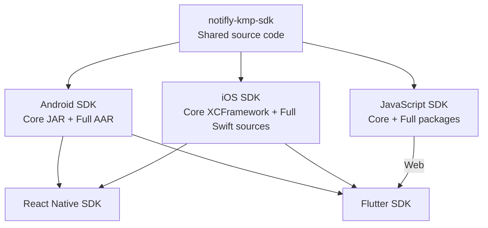

<p align="center">
  <a href="https://notifly.tech">
    
  </a>
</p>

<h1 align="center">Notifly KMP SDK</h1>

<p align="center">
  Shared Kotlin Multiplatform core for the Notifly Android, iOS, and JavaScript SDKs.
</p>

<p align="center">
  <a href="https://github.com/notifly-tech/notifly-kmp-sdk/actions/workflows/ci.yml"></a>
  <a href="https://github.com/notifly-tech/notifly-kmp-sdk/blob/main/LICENSE"></a>
</p>

> [!NOTE]
> This repository contains shared source code. Each platform SDK builds and distributes its own Core and Full packages. Application developers can install either the Full SDK or the platform's Core package.

## Purpose

This module provides a shared implementation for behavior that should remain consistent across the Notifly SDKs. It reduces duplicated business logic while leaving platform integration and customer-facing SDK ownership with each platform repository.

This README covers the module's purpose, architectural boundaries, and contributor conventions. Keep individual feature descriptions and API usage examples in source-level documentation rather than maintaining a feature catalog here.

## Architecture



The library is one Gradle module with package-level architectural boundaries:

- `commonMain` owns shared domain logic, validation, and use cases.
- `jvmMain`, `iosMain`, and `jsMain` provide infrastructure adapters, such as HTTP engines, synchronization, and generic native value conversion. They must not become separate per-platform feature implementations.
- Each host SDK owns platform-specific product behavior, UI integration, SDK lifecycle decisions, and its customer-facing API.

Group shared code by feature under `tech.notifly.kmp`. Keep reusable infrastructure in `core`, independent of feature packages. Use `expect`/`actual` for platform capabilities, not to split business rules across platforms.

## Platform integration

The Android, iOS, and JavaScript repositories pin a KMP source commit as a Git submodule and build their own Core artifacts. Core and Full use the same platform SDK version, and Full depends on that exact Core version.

| SDK | Integration and distribution |
| --- | --- |
| [Android](https://github.com/team-michael/notifly-android-sdk) | Gradle composite build; Core JAR and Full AAR distributed through JitPack. |
| [iOS](https://github.com/team-michael/notifly-ios-sdk) | Dynamic `NotiflyCore.xcframework` and Full SDK Swift sources, available through SwiftPM and CocoaPods. |
| [JavaScript](https://github.com/team-michael/notifly-js-sdk) | `notifly-core-sdk` and `notifly-js-sdk` on npm; browser bundles include the required Core code. |
| [React Native](https://github.com/team-michael/notifly-react-native-sdk) | Uses the Android and iOS SDKs through native bridges. |
| [Flutter](https://github.com/team-michael/notifly_flutter) | Uses the Android and iOS SDKs; Flutter Web uses the JavaScript SDK. |

The iOS repository hosts the Core binary on its own GitHub Releases. Customers do not need to select a separate KMP source version.

## Contributor conventions

- Write repository documentation, comments, identifiers, and test names in English, except for required non-English test fixtures.
- Keep implementation details internal and public interfaces small and usable from Kotlin, Swift, and JavaScript.
- Explain contracts above declarations with KDoc. Minimize inline comments and document rationale rather than narrating code.
- Test observable behavior. Keep shared tests in `commonTest` and platform-specific infrastructure or interop tests in the corresponding platform test source set.
- Use the pinned ktlint configuration. Review formatting changes and keep unrelated edits out of a change.

See [AGENTS.md](AGENTS.md) for detailed architecture, language, comment, and test conventions, and [scripts/README.md](scripts/README.md) for build and validation tooling.

## Development

Requirements:

- JDK 17
- Node.js 22
- macOS with Xcode for Apple targets
- Chrome for browser tests

Check Kotlin source, tests, and Gradle scripts before committing:

```bash
./gradlew ktlintCheck --no-daemon
```

Apply automatic formatting when needed, then rerun the check:

```bash
./gradlew ktlintFormat --no-daemon
./gradlew ktlintCheck --no-daemon
```

The ktlint Gradle plugin and engine versions are pinned in `build.gradle.kts`.
Style settings live in `.editorconfig`. CI and new releases run the check without
modifying files. Resuming an existing release skips lint so older tags remain
rebuildable. Semantic conventions still require review.

Run the shared test suite:

```bash
./gradlew \
  jvmTest \
  jsNodeTest \
  jsBrowserTest \
  iosSimulatorArm64Test \
  --no-daemon
```

## Kotlin compatibility

The build uses Kotlin `2.2.21`. Common and JVM code target Kotlin language/API `1.8` with stdlib `1.8.10` for Android compatibility. Kotlin/JS uses the stdlib matching the build compiler.

## Repository structure

```text
.
├── src/          # Shared Kotlin Multiplatform sources
├── scripts/      # Build and validation tools
├── smoke-tests/  # Consumer-level verification projects
└── .github/      # Automation workflows
```

## Links

- [Notifly](https://notifly.tech)
- [Documentation](https://docs.notifly.tech)
- [Issues](https://github.com/notifly-tech/notifly-kmp-sdk/issues)
- [MIT License](LICENSE)
