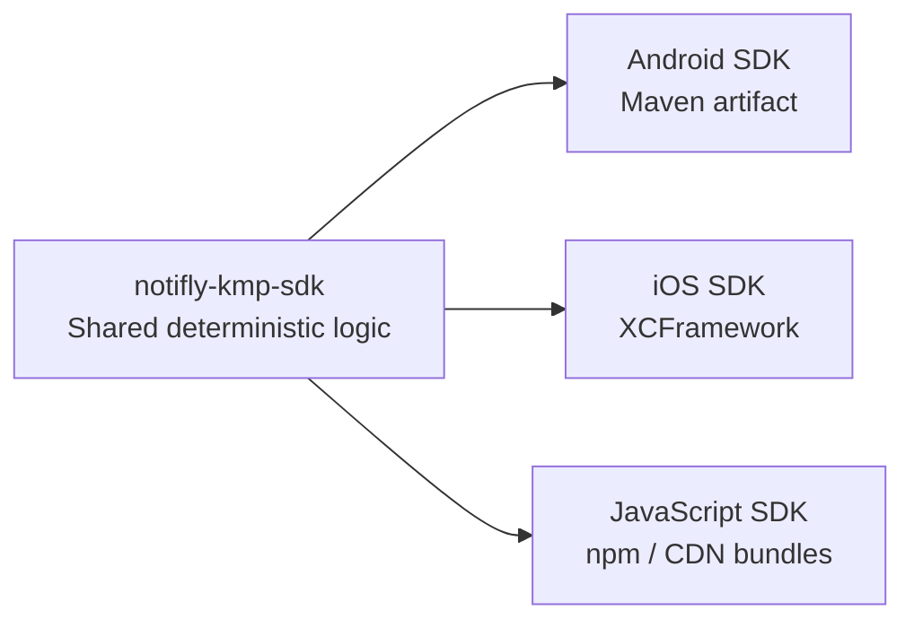

<p align="center">
  <a href="https://notifly.tech">
    
  </a>
</p>

<h1 align="center">Notifly KMP SDK</h1>

<p align="center">
  Shared Kotlin Multiplatform core for the Notifly Android, iOS, and JavaScript SDKs.
</p>

<p align="center">
  <a href="https://github.com/notifly-tech/notifly-kmp-sdk/actions/workflows/ci.yml"></a>
  <a href="https://github.com/notifly-tech/notifly-kmp-sdk/releases"></a>
  <a href="https://github.com/notifly-tech/notifly-kmp-sdk/blob/main/LICENSE"></a>
</p>

> [!IMPORTANT]
> This is an internal shared core, not a standalone SDK for application developers. Install the Notifly SDK for your platform instead.

## At a glance

| | |
| --- | --- |
| Module | root project |
| Package | `tech.notifly.kmp` |
| Targets | JVM, Kotlin/JS IR, iOS device and simulator |
| Consumers | Notifly Android, iOS, and JavaScript SDKs |
| Current shared policy | `UserIdTransitionPolicy` |

## Architecture



Each platform SDK keeps its existing public API and UI behavior. Shared logic and popup rendering requests live in this repository, with platform-specific HTTP engines behind the common implementation.

## Current scope

`UserIdTransitionPolicy` produces the same user ID transition decision on every platform:

```kotlin
val decision = UserIdTransitionPolicy.evaluate(
    previousUserId = null,
    newUserId = "user-123",
)

decision.shouldSync  // true
decision.shouldMerge // true
decision.shouldClear // false
```

### Popup rendering

`PopupFactory.create(config)` creates a reusable renderer. Only the exact mode `ssr`
calls the injected rendering service; other modes return `static` without reading
event parameters. The host SDK remains responsible for displaying the result.

Kotlin callers pass `eventParams: Map<String, Any?>?` to `PopupRenderInput`. Swift
callers pass `[String: Any]` directly, including nested dictionaries, arrays,
booleans, numbers, and `NSNull()`. Callers no longer serialize event parameters to
an `eventParamsJson` string.

JavaScript callers use the JS-specific helper so native objects and arrays are
converted inside KMP:

```javascript
const popup = sdk.tech.notifly.kmp.popup;
const renderer = popup.PopupFactory.create(new popup.model.PopupRendererConfig(
  projectId, renderingBaseUrl, sdkVersion,
));
const input = popup.createPopupRenderInput(
  "ssr", campaignId, notiflyUserId, deviceId, "purchase",
  { items: [{ id: "P1", quantity: 2 }], enabled: true },
);
const task = renderer.render(input, (result) => {
  // Handle static, rendered, skipped, failed, or cancelled outcomes in the host SDK.
});
```

Null or omitted JS parameters become `{}`. Supported values are strings, booleans,
finite numbers, nulls, lists/JS arrays, and nested string-keyed maps/JS plain objects.
Unsupported values and circular references produce `invalid_request` without an
HTTP request. Nested JS `undefined`, functions, symbols, bigint, and class instances
are unsupported. JS numbers keep JavaScript's existing precision; Swift/Kotlin
64-bit integers are not rounded through `Double` during encoding. Do not mutate
Kotlin/Swift input collections while a render is pending.

Use `task.cancel()` to cancel one render and `renderer.close()` when releasing the
owning SDK. Results are delivered asynchronously, with no main-thread guarantee.

## Platform integration

| SDK | How it consumes the KMP core | Customer-facing artifact |
| --- | --- | --- |
| Android | Builds the pinned submodule as a Gradle project | Maven Central package |
| iOS | Builds a static `NotiflyKMP.xcframework` and links it into the SDK | `notifly_sdk.xcframework` |
| JavaScript | Builds Kotlin/JS locally and inlines it into the SDK bundles | npm and CDN bundles |

Host SDKs pin an exact KMP tag commit as a Git submodule. Moving branches and version ranges are not supported.

## Development

Requirements:

- JDK 17
- Node.js 22
- Xcode 16 or later for Apple targets

Check Kotlin source, tests, and Gradle scripts before committing:

```bash
./gradlew ktlintCheck --no-daemon
```

Apply automatic formatting when needed, then rerun the check:

```bash
./gradlew ktlintFormat --no-daemon
./gradlew ktlintCheck --no-daemon
```

The ktlint Gradle plugin and engine versions are pinned in `build.gradle.kts`.
Style settings live in `.editorconfig`. CI and new releases run the check without
modifying files. Resuming an existing release skips lint so older tags remain
rebuildable. See [AGENTS.md](AGENTS.md) for English-language, comment, and test
conventions; semantic conventions still require review.

Run the shared test suite:

```bash
./gradlew \
  jvmTest \
  jsNodeTest \
  iosSimulatorArm64Test \
  --no-daemon
```

Build and smoke-test all platform artifacts:

```bash
./gradlew \
  publishToMavenLocal \
  packJsPackage \
  assembleNotiflyKMPReleaseXCFramework \
  --no-daemon

scripts/smoke-maven-local.sh
node scripts/smoke-js-package.mjs build/packages/notifly-kmp-sdk-0.1.0-alpha.1.tgz
scripts/smoke-apple-artifacts.sh
```

## Kotlin compatibility

The build uses Kotlin Gradle Plugin `2.2.21` for current Multiplatform and Apple toolchain support. Published common and JVM code is restricted to Kotlin language/API version `1.8` and Kotlin stdlib `1.8.10`, keeping it compatible with the current Notifly Android SDK.

Kotlin/JS uses the stdlib matching the build compiler, as required by the Kotlin/JS compiler. This does not change the Kotlin requirement of the Android/JVM artifact.

## Release flow

1. Run the `Release` workflow with an `x.y.z-alpha.n` version.
2. Verify JVM, JavaScript, and Apple outputs and their smoke tests.
3. Create an immutable Git tag and GitHub prerelease.
4. Open submodule-bump pull requests for the Android, iOS, and JavaScript SDKs.
5. Let each host SDK build and publish its own customer-facing artifact.

The attached `NotiflyKMP.xcframework` is a validation artifact. The iOS SDK rebuilds the framework from its pinned source. This repository does not directly publish npm, CocoaPods, or JitPack packages.

## Repository structure

```text
.
├── src/          # Shared Kotlin Multiplatform sources
├── scripts/      # Release preparation and smoke tests
├── smoke-tests/  # Consumer-level verification projects
└── .github/      # CI and release workflows
```

## Links

- [Notifly](https://notifly.tech)
- [Documentation](https://docs.notifly.tech)
- [Releases](https://github.com/notifly-tech/notifly-kmp-sdk/releases)
- [Issues](https://github.com/notifly-tech/notifly-kmp-sdk/issues)
- [MIT License](LICENSE)
